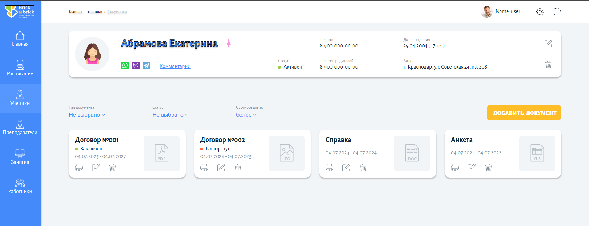

# Приложение для управления документами студента

## Демо прокета: https://keepcode-teacher-app.vercel.app/

## Описание проекта

Это приложение представляет собой систему управления документами студента. Оно позволяет просматривать, добавлять и удалять различные документы, такие как договоры, справки и другие файлы. Приложение обладает удобным и интуитивно понятным интерфейсом, а также функционалом фильтрации и валидации данных.

## Функциональные возможности

* **Просмотр документов:** Отображение списка документов в виде карточек.
* **Фильтрация:** Возможность фильтровать документы по типу (`Договор`, `Справка`, `Другое`) и статусу (`Заключен`, `Расторгнут`).
* **Добавление нового документа:** Модальное окно для создания нового документа с полями:
    * Тип документа (Договор, Справка, Другое)
    * Название документа
    * Номер
    * Период действия (с ... по ...)
    * Опции оповещения и создания задачи
    * Загрузка файла
* **Валидация формы:** Обязательные поля (`Тип документа` и `Название`) должны быть заполнены перед отправкой.
* **Удаление документа:** Возможность удалить любую карточку документа.

## Технологический стек

* **Vue 3:** Прогрессивный JavaScript-фреймворк.
* **Pinia:** Управление состоянием приложения.
* **SCSS:** Препроцессор CSS для удобного и модульного написания стилей.
* **Vite:** Современный и быстрый инструмент для сборки фронтенда.

## Установка и запуск

Чтобы запустить проект локально, выполните следующие шаги:

1.  Клонируйте репозиторий:
    ```bash
    git clone <URL_вашего_репозитория>
    cd <название_проекта>
    ```

2.  Установите зависимости:
    ```bash
    npm install
    # или
    yarn
    # или
    pnpm install
    ```

3.  Запустите приложение в режиме разработки:
    ```bash
    npm run dev
    # или
    yarn dev
    # или
    pnpm dev
    ```

4.  Откройте [http://localhost:5173](http://localhost:5173) в вашем браузере.

## Структура проекта

* `src/components/`: Переиспользуемые компоненты, такие как `AppButton.vue`, `DocumentCard.vue` и т.д.
* `src/views/`: Компоненты-страницы, например, `DocumentsView.vue`.
* `src/stores/`: Pinia-сторы для централизованного управления состоянием (`documents.js`).
* `src/api/`: Файлы для симуляции API-запросов (`api.js`).
* `src/styles/`: Глобальные стили, переменные и миксины.